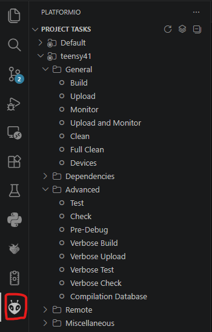
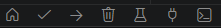
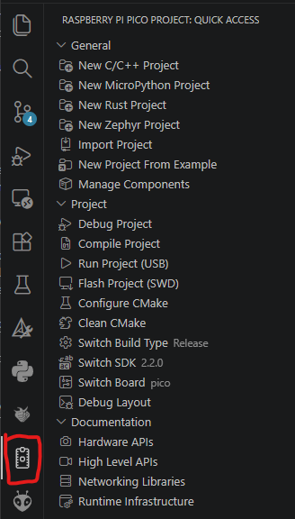

# Robocup CPPware

## Description

The 2026 competition brought to light the current short comings of rust in the form of lacking infrastructure and lengthy debug process. To remedy this a full rewrite of the firmware stack into C++ was proposed and carried out. 

This brings us to the current 3rd rewrite of the Robojackets Robocup firmware.

## Setup

To start clone to repo locally:

```sh
git clone https://github.com/Dashjax/robocup-cppware.git
```
#### Note for Windows you will need some form of Git access such as the [Git Bash](https://git-scm.com/install/windows) (easier) or [WSL](https://learn.microsoft.com/en-us/windows/wsl/install). Or just switch to Linux you will thank yourself later.

There are currently three different frameworks being used to program the robot each with different processes (This will hopefully be reduced in the future).

### Control

The main controller, currently a Teensy 4.1, utilizes the Arduino framework using Platformio.

The easiest method is to use it with its VSCode extension [here](https://marketplace.visualstudio.com/items?itemName=platformio.platformio-ide), however versions for other editors include purely CLI is available on their website [here](https://platformio.org/platformio-ide).

### Kicker

The kicker board, currently a RP2040 (Pico), is programmed using the dedicated Raspberry PI Pico SDK.

Once again the easiest method is to use the VSCode extension [here](https://marketplace.visualstudio.com/items?itemName=raspberry-pi.raspberry-pi-pico), however other versions are available [here](https://www.raspberrypi.com/documentation/microcontrollers/c_sdk.html).

### Motorboard

Currently the motors have not been ported to C++ and still use the rust version, this should be prioritized to be updated as the installation process is a pain.

Please visit the rust repo for further instructions [here](https://github.com/RoboJackets/robocup-rustware).

## Usage

### Control

Ensure you have the entire control folder open in VSCode and select the Platformio icon. Here you will find most of the needed functionality to compile and upload to the control board.

+ Build: Compiles your code but does not attempt to upload. Good for error checking.
+ Upload: Compiles and attempts to upload to the teensy. May fail for many reasons but once compiled you can just press the program button on the teensy to try the upload again so long as you don't close the uploader.
+ Clean: Removes all temporary files forcing a full recompile. Can fix many errors.
+ Test: Runs the tests in the test folder. Requires the teensy to be available as they will be run on it.



Additionally shortcuts for build, upload, clean, and test (and more) can be found in the bottom left of your VSCode instance.



### Kicker

Ensure you have the entire kicker folder open in VSCode and select the Pico SDK icon. Here you will find most of the needed functionality to compile and upload to the kicker board.

+ Compile Project: Compiles your code but does not attempt to upload. Good for error checking.
+ Run Project: Compiles and attempts to upload to the kicker.
+ Clean CMake: Removes all temporary files forcing a full recompile. Can fix many errors.



### Motorboard

Once again see rust repo [here](https://github.com/RoboJackets/robocup-rustware).

## Troubleshooting

This will hopefully be a living document and more tips will be added later, however I can only speculate as to what issues you may have from past experience.

### Control

+ LED keeps blinking after upload: An upload error occured, press the reprogram button on the Teensy again.

### Kicker

+ Device not detected by computer: Due to how the reset line is wired, you must either have the control board also plugged into your PC, or removed from the robot for it to be able to boot/reboot.

### Moterboard

+ Keeps erroring on upload: God have mercy on your soul, you must perform a frame perfect reset while uploading. This was patched at somepoint but remnents may still remain. Ask someone for help.

## Useful Links

Control Board Pinout/Info Sheet: https://docs.google.com/spreadsheets/d/1R4ADXmqaLGxfWDbyh1WTpnZDjxXoTz-bSd3AXz-UCJA/edit?usp=sharing
